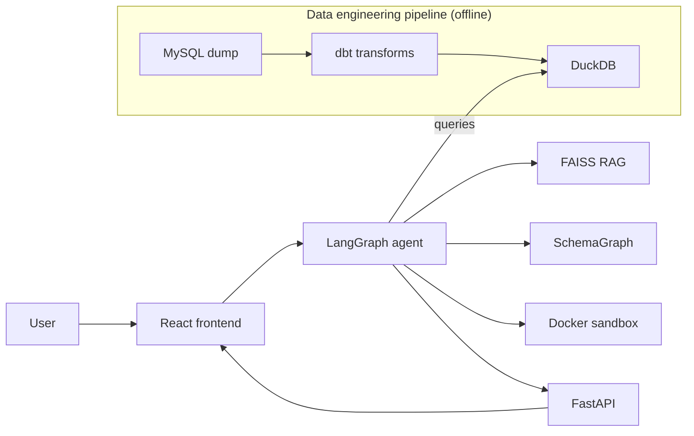

<div align="center">

# CaliperLens
</center>

<center>
<p>
    
    
    
    
    
    
</p>
</center>

An agentic natural-language-to-SQL engine for querying complex healthcare datasets. Uses a multi-agent sandboxed workflow to reason through database schemas and generate complex queries.

<div align="left">

## Getting Started

```bash
git clone https://github.com/Eros483/CaliperLens.git
cd CaliperLens
cp .env.example .env
```

Set your `.env` with the required keys (see `.env.example`).

```bash
make setup    # Install all dependencies
make dev      # Start frontend + backend
make test     # Run all tests
make style    # Format + lint
```

For the complete architecture — agent graph, tools exposed to the LLM, guardrails, data pipeline, and infra — see [docs/design.md](docs/design.md).

## Data Pipeline

MySQL holds the raw dump; dbt builds the DuckDB marts the agent queries.

```bash
make infra-up   # Start MySQL + backend + Prometheus + Grafana
make db-load    # Load db-dump.sql into MySQL (one-time, ~25 min for the 1.2G dump)
make dbt-run    # Transform MySQL → DuckDB marts (data/caliperlens.duckdb)
```

## System Flow

The diagram shows the two pipelines that keep CaliperLens running: the **offline data pipeline** (MySQL → DuckDB, scheduled by Airflow) and the **online query pipeline** (user question → validated answer).



## Architecture


## License

BUSL-1.1 — free for personal, educational, and portfolio use. Production or commercial deployment requires a separate license. See [LICENSE](LICENSE).
